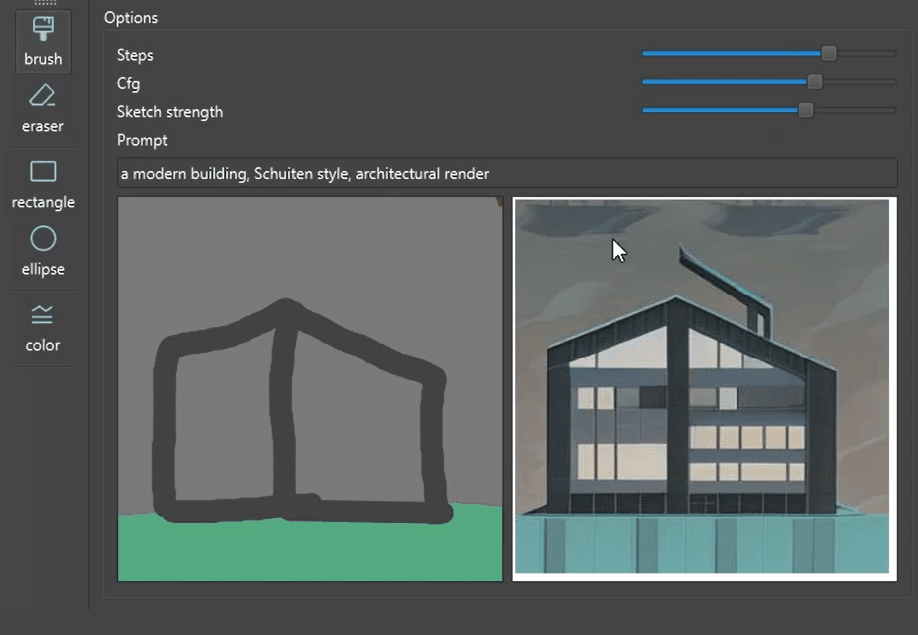

# PaintLCM
Image generation based on simple brush strokes. The Gradio code from <a>https://github.com/flowtyone/flowty-realtime-lcm-canvas</a> was adapted to Pyside6.

## Usage
Paint with brush or add simple shapes and see the proposed image adapting live.
CTRL + wheel to adapt cursor size. The SD model can be adapted in the lcm.py file.
Voilà!

NB: Working with Pyside 6.5.2

## Credits
The 'lcm.py' is adapted from https://github.com/flowtyone

